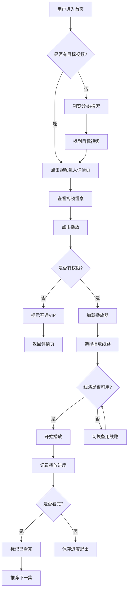

# 用户流程

## 1. 主流程

### 1.1 用户观看视频流程

```
1. 用户进入首页
2. 用户浏览分类/搜索视频
3. 用户点击视频封面
4. 系统加载视频详情页
5. 用户点击播放按钮
6. 系统加载播放器
7. 用户选择播放线路
8. 系统开始播放视频
9. 系统记录播放进度
10. 用户观看完成或退出
```

### 1.2 站长添加视频流程

```
1. 站长登录管理后台
2. 进入视频管理页面
3. 点击"添加视频"
4. 填写视频信息（标题、简介、分类等）
5. 上传封面图片
6. 添加播放源（多个）
7. 添加分集（可选）
8. 保存视频
9. 系统自动生成详情页
10. 视频在前台展示
```

### 1.3 采集任务执行流程

```
1. 站长配置采集规则
2. 设置定时任务或手动触发
3. 系统解析采集规则
4. 系统请求目标URL
5. 系统解析返回数据
6. 系统下载图片到本地
7. 系统匹配分类
8. 系统去重处理
9. 系统保存到数据库
10. 系统生成采集报告
```

## 2. 替代流程

### 2.1 用户搜索替代流程

```
1. 用户在首页点击搜索框
2. 用户输入关键词
3. 系统实时显示搜索建议
4. 用户选择建议或按回车
5. 系统显示搜索结果页
6. 用户筛选结果（分类、年份等）
7. 用户点击目标视频
```

### 2.2 用户收藏替代流程

```
1. 用户在播放页点击"收藏"按钮
2. 系统检查用户登录状态
3. 未登录用户跳转登录页
4. 已登录用户直接收藏
5. 系统保存收藏记录
6. 用户可在个人中心查看收藏
```

## 3. 异常流程

### 3.1 播放源失效

```
1. 用户点击播放
2. 系统尝试加载播放源
3. 播放源返回404/403错误
4. 系统自动切换到备用线路
5. 如所有线路失效，显示"视频维护中"
6. 记录失效日志，通知管理员
```

### 3.2 用户无权限

```
1. 用户点击VIP视频
2. 系统检查用户权限
3. 非VIP用户显示"VIP专享"
4. 提示用户开通VIP
5. 提供试看功能（前3分钟）
```

### 3.3 数据为空

```
1. 用户进入分类页
2. 该分类下无视频
3. 显示"暂无内容"空态
4. 推荐其他分类热门视频
```

### 3.4 重复操作

```
1. 用户快速点击收藏
2. 系统检测到重复请求
3. 显示"已收藏"提示
4. 防止重复数据写入
```

## 4. 页面 / 触点清单

| 页面 / 触点 | 谁访问 | 入口 | 出口 | 备注 |
|---|---|---|---|---|
| 首页 | 所有用户 | 直接访问 | 分类页、详情页、搜索页 | 展示热门、推荐 |
| 分类页 | 所有用户 | 首页导航 | 详情页 | 按分类筛选 |
| 详情页 | 所有用户 | 首页、分类页、搜索页 | 播放页 | 视频信息展示 |
| 播放页 | 所有用户 | 详情页 | 下一集、相关推荐 | 视频播放 |
| 搜索页 | 所有用户 | 首页搜索框 | 详情页 | 搜索结果 |
| 用户中心 | 登录用户 | 首页头像 | - | 收藏、历史、设置 |
| 登录页 | 未登录用户 | 需要登录的操作 | 原页面 | 登录注册 |
| 管理后台 | 管理员 | 独立入口 | - | 内容管理 |
| 采集管理 | 管理员 | 管理后台 | - | 采集配置 |

## 5. 流程图


