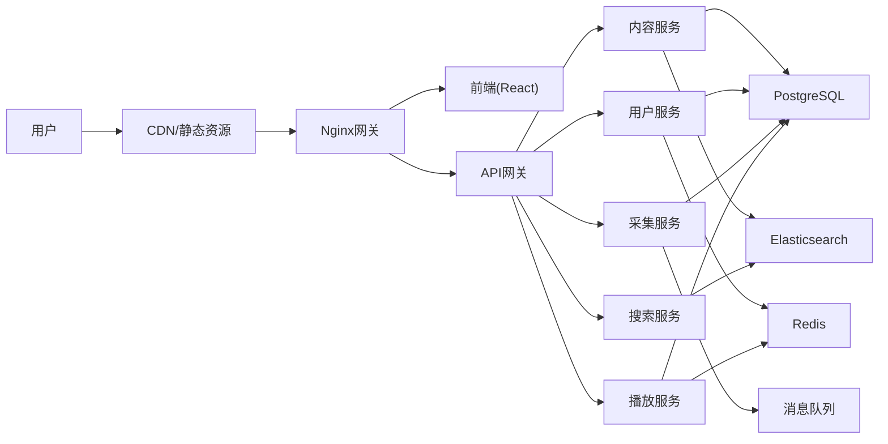

# 系统架构说明

## 1. 总体架构

采用前后端分离的微服务架构：

- **前端**：React 18 + TypeScript + Ant Design
- **后端**：Node.js + Express + TypeScript
- **数据库**：PostgreSQL 15（主数据库）
- **缓存**：Redis 7（会话、热点数据）
- **搜索**：Elasticsearch（全文搜索）
- **消息队列**：Redis（异步任务）
- **部署**：Docker + Docker Compose

## 2. 模块划分

| 模块 | 责任 | 输入 | 输出 | 依赖 |
|------|------|------|------|------|
| 内容服务 | 视频、文章、分类管理 | 内容数据 | 内容API | 数据库、搜索 |
| 用户服务 | 用户注册、登录、权限 | 用户请求 | 用户API | 数据库、缓存 |
| 采集服务 | 数据采集、清洗、入库 | 采集规则 | 采集结果 | 数据库、消息队列 |
| 搜索服务 | 全文搜索、推荐 | 搜索词 | 搜索结果 | Elasticsearch |
| 播放服务 | 播放器、播放记录 | 播放请求 | 播放信息 | 数据库、缓存 |
| 文件服务 | 图片上传、存储 | 文件流 | 文件URL | 对象存储 |

## 3. 核心边界

### 必须隔离的模块

- **用户服务**与**内容服务**：用户操作不直接影响内容
- **采集服务**与**内容服务**：采集异常不影响现有内容
- **搜索服务**：独立部署，不影响核心业务

### 可以复用的模块

- **数据库连接池**：所有服务共享
- **缓存层**：Redis统一缓存
- **日志服务**：统一日志收集

### 强耦合风险点

- 采集服务与内容服务：采集直接写入内容库
- 播放器与内容服务：播放依赖内容数据

## 4. 关键技术决策

### 为什么选React+Node.js？

- **React**：组件化开发，生态成熟，适合大型应用
- **Node.js**：前后端同构，开发效率高，性能满足需求
- **TypeScript**：类型安全，维护性好

### 为什么不选PHP（苹果CMS技术栈）？

- PHP技术栈老旧，维护困难
- 前后端分离是现代趋势
- Node.js性能更好，扩展性更强

### 技术风险

- **风险1**：Node.js单线程，CPU密集型任务需额外处理
  - **应对**：使用Worker Threads或独立服务
- **风险2**：PostgreSQL性能瓶颈
  - **应对**：读写分离、分库分表
- **风险3**：采集被封IP
  - **应对**：代理池、请求频率控制

## 5. 运行链路

## 6. 横切能力

### 认证与鉴权

- JWT Token认证
- RBAC权限模型
- API权限控制

### 日志

- 结构化日志（JSON格式）
- 日志级别：ERROR/WARN/INFO/DEBUG
- 日志收集：ELK Stack

### 监控

- 应用监控：Prometheus + Grafana
- 业务监控：播放量、用户数
- 告警：钉钉/企业微信通知

### 限流

- API限流：1000次/分钟/IP
- 采集限流：100条/次，最小间隔5分钟

### 缓存

- 热点数据：Redis缓存，TTL 1小时
- 页面缓存：CDN缓存，TTL 24小时

### 幂等

- 采集任务：去重键（标题+年份）
- 支付操作：唯一订单号

### 审计

- 操作日志：谁、何时、做了什么
- 数据变更：记录变更前后值
