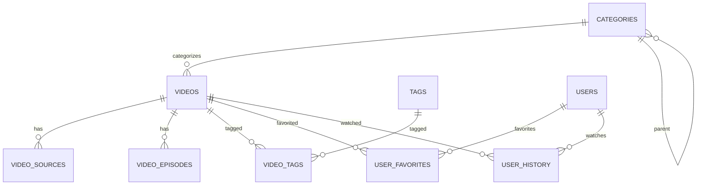

# 数据模型

## 1. 实体清单

| 实体 | 说明 | 主键 | 备注 |
|---|---|---|---|
| videos | 视频信息 | id | 核心实体 |
| video_sources | 视频播放源 | id | 多对一关联videos |
| video_episodes | 视频分集 | id | 多对一关联videos |
| categories | 分类 | id | 树形结构 |
| tags | 标签 | id | 多对多关联videos |
| video_tags | 视频标签关联 | id | 关联表 |
| users | 用户 | id | |
| user_favorites | 用户收藏 | id | 关联users和videos |
| user_history | 用户播放历史 | id | 关联users和videos |
| collect_rules | 采集规则 | id | |
| collect_logs | 采集日志 | id | |
| admins | 管理员 | id | |
| settings | 系统设置 | key | 键值对存储 |

## 2. 字段定义

### 2.1 videos（视频表）

| 字段 | 类型 | 必填 | 默认值 | 约束 | 说明 |
|---|---|---|---|---|---|
| id | SERIAL | 是 | 自增 | PRIMARY KEY | 主键 |
| title | VARCHAR(255) | 是 | - | UNIQUE | 视频标题 |
| subtitle | VARCHAR(255) | 否 | NULL | - | 副标题 |
| description | TEXT | 否 | NULL | - | 简介 |
| cover_image | VARCHAR(500) | 否 | NULL | - | 封面图片URL |
| category_id | INTEGER | 是 | - | FOREIGN KEY | 分类ID |
| year | INTEGER | 否 | NULL | - | 年份 |
| area | VARCHAR(50) | 否 | NULL | - | 地区 |
| lang | VARCHAR(50) | 否 | NULL | - | 语言 |
| director | VARCHAR(255) | 否 | NULL | - | 导演 |
| actors | VARCHAR(500) | 否 | NULL | - | 演员 |
| duration | INTEGER | 否 | NULL | - | 时长(分钟) |
| status | INTEGER | 是 | 1 | CHECK(0,1,2) | 0:下架 1:上架 2:审核中 |
| is_vip | BOOLEAN | 是 | FALSE | - | VIP专享 |
| is_recommend | BOOLEAN | 是 | FALSE | - | 推荐 |
| is_hot | BOOLEAN | 是 | FALSE | - | 热门 |
| hits | INTEGER | 是 | 0 | - | 点击量 |
| hits_day | INTEGER | 是 | 0 | - | 日点击量 |
| hits_week | INTEGER | 是 | 0 | - | 周点击量 |
| hits_month | INTEGER | 是 | 0 | - | 月点击量 |
| created_at | TIMESTAMP | 是 | NOW() | - | 创建时间 |
| updated_at | TIMESTAMP | 是 | NOW() | - | 更新时间 |

### 2.2 video_sources（播放源表）

| 字段 | 类型 | 必填 | 默认值 | 约束 | 说明 |
|---|---|---|---|---|---|
| id | SERIAL | 是 | 自增 | PRIMARY KEY | 主键 |
| video_id | INTEGER | 是 | - | FOREIGN KEY | 视频ID |
| name | VARCHAR(50) | 是 | - | - | 线路名称 |
| url | TEXT | 是 | - | - | 播放地址 |
| type | VARCHAR(20) | 是 | 'm3u8' | - | m3u8/mp4/flv |
| sort_order | INTEGER | 是 | 0 | - | 排序 |
| status | INTEGER | 是 | 1 | - | 0:失效 1:正常 |
| created_at | TIMESTAMP | 是 | NOW() | - | 创建时间 |

### 2.3 video_episodes（分集表）

| 字段 | 类型 | 必填 | 默认值 | 约束 | 说明 |
|---|---|---|---|---|---|
| id | SERIAL | 是 | 自增 | PRIMARY KEY | 主键 |
| video_id | INTEGER | 是 | - | FOREIGN KEY | 视频ID |
| episode_number | INTEGER | 是 | - | - | 集数 |
| title | VARCHAR(255) | 否 | NULL | - | 分集标题 |
| sources | JSONB | 是 | '{}' | - | 播放源JSON |
| created_at | TIMESTAMP | 是 | NOW() | - | 创建时间 |

### 2.4 categories（分类表）

| 字段 | 类型 | 必填 | 默认值 | 约束 | 说明 |
|---|---|---|---|---|---|
| id | SERIAL | 是 | 自增 | PRIMARY KEY | 主键 |
| name | VARCHAR(100) | 是 | - | - | 分类名称 |
| slug | VARCHAR(100) | 是 | - | UNIQUE | URL别名 |
| parent_id | INTEGER | 否 | NULL | FOREIGN KEY | 父分类ID |
| sort_order | INTEGER | 是 | 0 | - | 排序 |
| status | INTEGER | 是 | 1 | - | 0:隐藏 1:显示 |
| created_at | TIMESTAMP | 是 | NOW() | - | 创建时间 |

### 2.5 tags（标签表）

| 字段 | 类型 | 必填 | 默认值 | 约束 | 说明 |
|---|---|---|---|---|---|
| id | SERIAL | 是 | 自增 | PRIMARY KEY | 主键 |
| name | VARCHAR(100) | 是 | - | UNIQUE | 标签名称 |
| slug | VARCHAR(100) | 是 | - | UNIQUE | URL别名 |
| created_at | TIMESTAMP | 是 | NOW() | - | 创建时间 |

### 2.6 video_tags（视频标签关联表）

| 字段 | 类型 | 必填 | 默认值 | 约束 | 说明 |
|---|---|---|---|---|---|
| id | SERIAL | 是 | 自增 | PRIMARY KEY | 主键 |
| video_id | INTEGER | 是 | - | FOREIGN KEY | 视频ID |
| tag_id | INTEGER | 是 | - | FOREIGN KEY | 标签ID |
| UNIQUE(video_id, tag_id) | - | - | - | - | 联合唯一 |

### 2.7 users（用户表）

| 字段 | 类型 | 必填 | 默认值 | 约束 | 说明 |
|---|---|---|---|---|---|
| id | SERIAL | 是 | 自增 | PRIMARY KEY | 主键 |
| username | VARCHAR(50) | 是 | - | UNIQUE | 用户名 |
| email | VARCHAR(100) | 否 | NULL | UNIQUE | 邮箱 |
| phone | VARCHAR(20) | 否 | NULL | UNIQUE | 手机号 |
| password_hash | VARCHAR(255) | 是 | - | - | 密码哈希 |
| avatar | VARCHAR(500) | 否 | NULL | - | 头像URL |
| vip_level | INTEGER | 是 | 0 | - | VIP等级 |
| vip_expire_at | TIMESTAMP | 否 | NULL | - | VIP过期时间 |
| status | INTEGER | 是 | 1 | - | 0:禁用 1:正常 |
| last_login_at | TIMESTAMP | 否 | NULL | - | 最后登录时间 |
| created_at | TIMESTAMP | 是 | NOW() | - | 创建时间 |

### 2.8 user_favorites（用户收藏表）

| 字段 | 类型 | 必填 | 默认值 | 约束 | 说明 |
|---|---|---|---|---|---|
| id | SERIAL | 是 | 自增 | PRIMARY KEY | 主键 |
| user_id | INTEGER | 是 | - | FOREIGN KEY | 用户ID |
| video_id | INTEGER | 是 | - | FOREIGN KEY | 视频ID |
| created_at | TIMESTAMP | 是 | NOW() | - | 创建时间 |
| UNIQUE(user_id, video_id) | - | - | - | - | 联合唯一 |

### 2.9 user_history（用户播放历史表）

| 字段 | 类型 | 必填 | 默认值 | 约束 | 说明 |
|---|---|---|---|---|---|
| id | SERIAL | 是 | 自增 | PRIMARY KEY | 主键 |
| user_id | INTEGER | 是 | - | FOREIGN KEY | 用户ID |
| video_id | INTEGER | 是 | - | FOREIGN KEY | 视频ID |
| episode_id | INTEGER | 否 | NULL | FOREIGN KEY | 分集ID |
| progress | INTEGER | 是 | 0 | - | 播放进度(秒) |
| duration | INTEGER | 是 | 0 | - | 总时长(秒) |
| is_finished | BOOLEAN | 是 | FALSE | - | 是否看完 |
| updated_at | TIMESTAMP | 是 | NOW() | - | 更新时间 |
| UNIQUE(user_id, video_id) | - | - | - | - | 联合唯一 |

### 2.10 collect_rules（采集规则表）

| 字段 | 类型 | 必填 | 默认值 | 约束 | 说明 |
|---|---|---|---|---|---|
| id | SERIAL | 是 | 自增 | PRIMARY KEY | 主键 |
| name | VARCHAR(100) | 是 | - | - | 规则名称 |
| source_type | VARCHAR(20) | 是 | - | - | xml/json/api |
| source_url | TEXT | 是 | - | - | 源地址 |
| rule_config | JSONB | 是 | '{}' | - | 规则配置JSON |
| schedule | VARCHAR(50) | 否 | NULL | - | Cron表达式 |
| last_collect_at | TIMESTAMP | 否 | NULL | - | 最后采集时间 |
| status | INTEGER | 是 | 1 | - | 0:禁用 1:启用 |
| created_at | TIMESTAMP | 是 | NOW() | - | 创建时间 |

## 3. 实体关系



## 4. 数据生命周期

- **创建**：数据通过管理后台或采集系统创建
- **更新**：内容变更时更新，记录更新时间
- **删除**：软删除（标记status=0），保留数据
- **归档**：历史数据定期归档，释放主库空间

## 5. 数据质量约束

- **唯一性**：视频标题唯一，用户名唯一，分类slug唯一
- **完整性**：外键约束，必填字段校验
- **一致性**：分类删除时，关联视频置为未分类
- **审计性**：所有表包含created_at/updated_at

## 6. 索引设计

```sql
-- 视频表索引
CREATE INDEX idx_videos_category ON videos(category_id);
CREATE INDEX idx_videos_status ON videos(status);
CREATE INDEX idx_videos_year ON videos(year);
CREATE INDEX idx_videos_is_vip ON videos(is_vip);
CREATE INDEX idx_videos_created ON videos(created_at DESC);

-- 播放源索引
CREATE INDEX idx_video_sources_video ON video_sources(video_id);
CREATE INDEX idx_video_sources_status ON video_sources(status);

-- 用户相关索引
CREATE INDEX idx_user_favorites_user ON user_favorites(user_id);
CREATE INDEX idx_user_favorites_video ON user_favorites(video_id);
CREATE INDEX idx_user_history_user ON user_history(user_id);
CREATE INDEX idx_user_history_updated ON user_history(updated_at DESC);

-- 采集规则索引
CREATE INDEX idx_collect_rules_status ON collect_rules(status);
```
